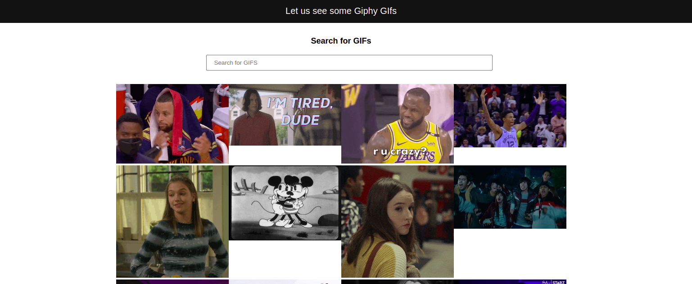

# Wise-Sayings
####  **Odero OLuoch**

Landing Page

Button to Load More

Search Input

## Description
This is a website that loads trending GIF's from the Giphy API. A user is able to search, and -- working on the load more bit.

## Technologies used
- Angular CLI
- TypeScript
- CSS
- HTML

## Bugs being worked on
- The load more button is not yet loading.

This project was generated with [Angular CLI](https://github.com/angular/angular-cli) version 11.2.12.

## Installation
Assuming you have Angular CLI installed, clone this project and navigate to the project folder. Run `yarn install` to download the required dependencies.

Run `ng serve` for a dev server. Navigate to `http://localhost:4200/`. The app will automatically reload if you change any of the source files. Alternatively, you can run `ng serve --open` or the shorthand `ng s -o` and the server will automatically open the app on the browser.

## Build

Run `ng build` to build the project. The build artifacts will be stored in the `dist/` directory. Use the `--prod` flag for a production build.

## Further help

To get more help on the Angular CLI use `ng help` or go check out the [Angular CLI Overview and Command Reference](https://angular.io/cli) page.

## Support and contact details
To help grow and make this product better, reach out to [email](mailto:oderoluoch@gmail.com).
### LICENSE

Copyright &copy; 2021 **[Odero OLuoch](www.github.com/OderoOluoch)**

